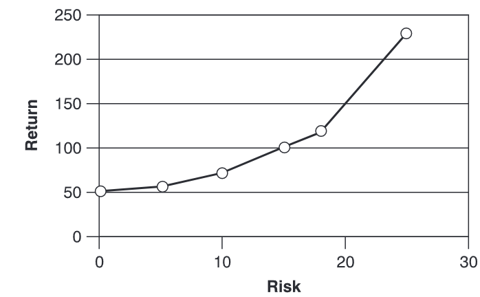
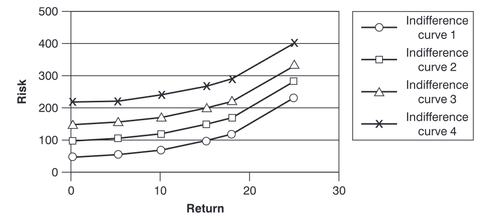
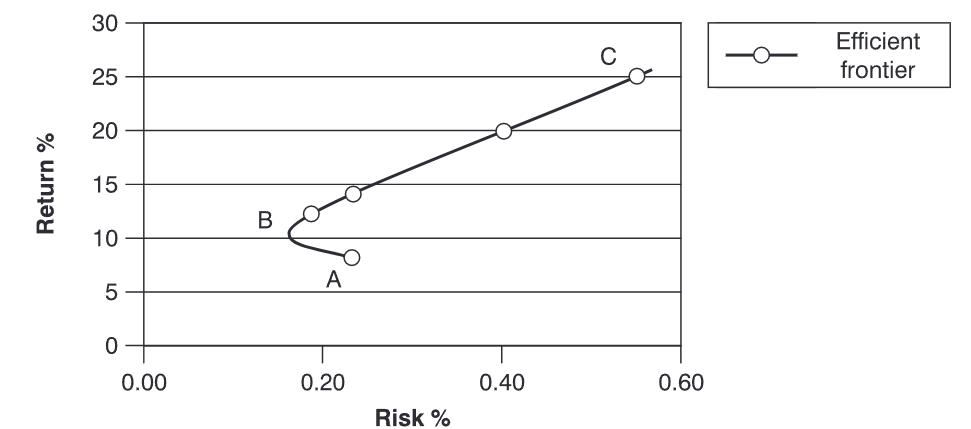
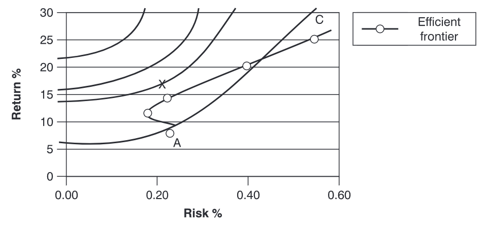
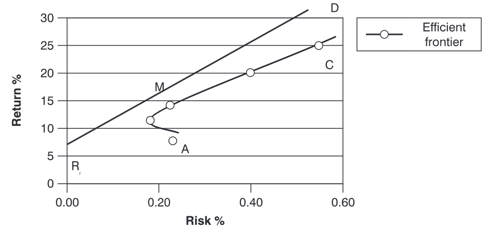

# 投资组合理论

*回到[目录](./目录.md)*

在讨论投资组合或基金管理时，必须考虑风险的概念。任何正在制定的投资组合都会在基金规则中设定某些风险约束，通常是为了满足具有特定风险偏好的投资者群体。因此，花时间讨论量化投资风险水平的基本理论，并尝试解释市场如何确定投资的市场价值，是非常重要的。

## 风险与风险厌恶
风险与回报是投资者投资于投资组合的原因。投资组合管理的理想目标是根据特定的风险约束，从最佳的风险-回报机会中创建一个最优投资组合。为了能够做出决策，必须能够量化特定机会中的风险程度。最常用的方法是使用预期回报的标准差。此方法衡量分布范围，而这些分布的可能回报提供了风险的衡量标准。
风险的存在意味着可能出现多个结果。投资预计会根据所处的环境产生不同的回报。

例如，给定投资 A 的以下情况：

| 情况       | 回报 (x) | 概率 (p) |
|------------|----------|----------|
| 情况 I     | 10%      | 0.2      |
| 情况 II    | 12%      | 0.3      |
| 情况 III   | 15%      | 0.4      |
| 情况 IV    | 19%      | 0.1      |

### 预期（或平均）回报
平均值（平均） = x = 预期值（EV） = \(\Sigma px\)

| 情况       | 回报 (x) | 概率 (p) | px   |
|------------|----------|----------|------|
| 情况 I     | 10%      | 0.2      | 2.0  |
| 情况 II    | 12%      | 0.3      | 3.6  |
| 情况 III   | 15%      | 0.4      | 6.0  |
| 情况 IV    | 19%      | 0.1      | 1.9  |
|            |          | 预期回报 | \(\Sigma px\) = 13.5% | 

### 标准差
标准差 (\(\sigma\)) = \(\sqrt{\Sigma p (x - \bar{x})^2}\) 此外，方差 (VAR) 等于标准差的平方，即 \(\sigma^2\)。

| 情况       | 回报 (x) | 概率 (p) | 偏离预期回报 (\(x - \bar{x}\))| \(p(x–\bar{x})^2\) |
|------------|----------|----------|---------------------|----------|
| 情况 I     | 10%      | 0.2      | -3.5%               | 2.45     |
| 情况 II    | 12%      | 0.3      | -1.5%               | 0.68     |
| 情况 III   | 15%      | 0.4      | +1.5%               | 1.90     |
| 情况 IV    | 19%      | 0.1      | +5.5%               | 3.03     |
|            |          |          |        方差 (VAR)    | 7.06     |

标准差 \(\sigma = \sqrt{\text{VAR}} = \sqrt{7.06} = 2.66\%\).

标准差是风险的衡量指标，其中标准差越大，波动范围越大，波动范围越大，风险也越大。
如果使用另一种投资进行上述计算，假设该投资提供相同的预期回报，但标准差不同，则可能会得到以下结果：

| 投资        | 预期回报 | 风险（标准差） |
|-------------|----------|----------------|
| 投资 A      | 9%       | 2.5%           |
| 投资 B      | 9%       | 4.0%           |

由于这两项投资的预期回报相同，因此最佳的投资选择是投资 A，因为它提供了较低的风险。同样，如果有两项投资的风险相同，但其中一项回报较高，则会选择回报较高的投资，而不是回报较低的投资。

在现实世界中，投资者类型各异。有些投资者完全避免风险，而另一些投资者愿意承担一定的风险，但期望获得更高的回报。不同的投资者对于风险与回报的权衡也有不同的容忍度或阈值——即在相同的风险水平下，一位投资者可能要求比另一位投资者更高的回报率。

## 无差异曲线

假设存在以下情况：

| 预期收益 | 风险（标准差） |
| --- | --- |
| 投资A | 10% | 5% |
| 投资B | 20% | 10% |

这里需要提出的问题是：额外的10%收益是否足以补偿额外的风险？这个问题没有标准答案，因为决策取决于特定投资者对风险的态度。通过绘制投资者在每个风险水平上要求的收益率，可以确定特定投资者的*无差异曲线*。

例如，可能有一位投资者在零风险的情况下可以获得50英镑的收益，而在风险（标准差）为5时获得55英镑的收益，这两种投资对他而言无差异。如果考虑其他投资，每种投资的风险程度更高，那么这位投资者将要求更高的收益率，使所有投资对他而言具有相同的吸引力。

所讨论的投资者的无差异曲线可能如下所示，并在下图中表示：

| 收益（Return） | 风险（Risk） |
|----------------|--------------|
| £50            | £0           |
| £55            | £5           |
| £70            | £10          |
| £100           | £15          |
| £120           | £18          |
| £230           | £25          |

|  |
| :--: |
| 无差异曲线 |

这种情况下，如果零风险的初始收益水平不同，该投资者可能会有不同的无差异曲线。需要针对各种风险–收益的起点重复这一分析。可以构建一整套无差异曲线，这些曲线将展现特定投资者对风险的态度。

|  |
| :--: |
| 无差异曲线对比 |

## 效用评分
在这个阶段，可以引入效用评分的概念。这可以被视为根据投资组合的预期收益和风险对其进行排名的一种方法。因此，如果基金经理需要确定特定投资者更偏好哪种投资，例如投资A的收益为10%，风险为5%，或投资B的收益为20%，风险为10%，经理会为该投资者创建无差异曲线并查看效用评分。
效用评分较高的投资组合或投资具有更具吸引力的风险–收益特征。虽然存在多种合法的评分系统，但一种常用的函数会为预期收益或价值为EV，且收益方差为\(\sigma^2\)的投资组合或投资分配以下效用值：

\[\text{U} = EV - 0.005A\sigma^2\]

其中：

- \(\text{U}\) = 效用值
- \(\text{A}\) = 投资者风险厌恶的指标（其中0.005是一个缩放常数，用于使公式中的预期收益和标准差可以以百分比而非小数形式表示）。

效用值因高预期收益而提升，因高风险而降低。在多个投资组合中做选择时，投资者会选择效用值最高的那个。因此，在上述例子中，投资者会选择效用值为18的投资（或投资组合）。

| 预期收益（\(\text{EV}\)）| 标准差（\(\sigma\)） | 效用值 (\(\text{U}\)) |  
|------------------|---------------|--------------------------------|  
| 10%              | 5%           | 10 – 0.005 × 4 × 25 = 9.5     |  
| 20%              | 10%          | 20 – 0.005 × 4 × 100 = 18     |  

（假设此情况下 \( A = 4 \)）

## 投资组合多元化

导致单个投资风险或收益波动的因素有很多。可能影响特定投资工具风险的因素包括：收入的不确定性、利率、通货膨胀、汇率、税率、经济状况、违约风险以及流动性风险（即无法出售该投资的风险）。此外，投资者还会在已持有的其他投资类型的背景下，评估某项投资（或投资组合）的风险，例如养老金基金的权益、带有储蓄成分的人寿保险以及房地产。

控制投资组合风险的一种方法是通过**多元化**，即投资于各种资产，从而限制对任何特定证券风险的暴露。这一概念基于古老的谚语“不要把所有的鸡蛋放在一个篮子里”。如果投资者仅持有一家公司的股票，该投资将根据影响该公司的因素而波动。如果该公司破产，投资者可能会损失100%的投资。然而，如果投资者持有多家公司、不同行业的股票，那么所有这些公司同时破产的可能性会大大降低。因此，多元化可以降低风险。虽然此处考虑的是破产风险，但同样的原则也适用于其他形式的风险。

### 协方差与相关性

投资组合的目标是持有一组投资或证券，以在不降低收益水平的情况下，尽可能降低风险水平。为了衡量一个潜在多元化投资组合的成功程度，需要考虑**协方差**和**相关性**。协方差用于衡量两个风险资产的收益在多大程度上同步变化。协方差为正表示两种资产的收益一起变化；协方差为负则表示两种资产的收益呈反向变化。

#### 协方差

\[ \text{COV}(x, y) = \sum p(x - \bar{x})(y - \bar{y}) \]

其中，\( x \) 和 \( y \) 是两项投资，\( p \) 是概率。

协方差是一种**绝对度量**，不同协方差值之间无法直接比较。为了获得一种相对度量，可以使用**相关系数** (\( r \)) 的公式。

#### 相关系数

\[ r = \frac{\text{COV}_{xy}}{\sigma_x \cdot \sigma_y} \]

以下是一个示例：

| 情况       | 概率 (p) | \( x - \bar{x} \) | \( y - \bar{y} \) | \( p(x - \bar{x})(y - \bar{y}) \) |
|------------|-----------|-------------------|-------------------|----------------------------------|
| I          | 0.2       | +1.0             | –3.5              | –0.7                             |
| II         | 0.3       | 0                | –1.5              | 0                                |
| III        | 0.4       | +1.5             | +1.5              | 0.9                              |
| IV         | 0.1       | –4               | +5.5              | –2.2                             |

\[ \text{COV}_{xy} = –2.0 \]

关于 \( y - \bar{y} \) 的数据，请参见之前的示例。假设对 \( x - \bar{x} \) 的数据进行了类似分析，且已知 \( x \) 的方差 (\( \sigma^2_x \)) 为 2.45，\( y \) 的方差 (\( \sigma^2_y \)) 为 7.06。因此，相关系数为：

\[ r = \frac{-2.0}{\sqrt{2.45} \cdot \sqrt{7.06}} = -0.481 \]

如果使用另一组 \( y \) 的数据重新运行此示例，可能会得到不同的相关系数，例如 \( r = -0.988 \)。可以得出结论，大的负相关表明这两项投资具有很强的反向变动趋势。

- **完全正相关**（相关系数 = +1）发生在两个证券的收益同步变化，且比例相同。如果将这些证券组合成一个投资组合，则不会出现“抵消”效应。
- **完全负相关**（相关系数 = –1）发生在一个证券上涨时，另一个证券下跌，且两者的变化比例完全相反。将这两种证券组合在投资组合中将增加多元化效应。
- **无相关**（相关系数 = 0）发生在两个证券的收益相互独立——即，一个证券上涨时，另一个可能上涨、下跌，或者完全不变。因此，这两种证券组合在投资组合中可能会或不会产生多元化效应。然而，这种情况仍然比完全正相关的情况要更有利。

### 非系统性风险与系统性风险

如前所述，**多元化**可以减少风险：投资组合或投资中持有的股票或资产越多，风险减少的效果越大。然而，即使进行广泛的多元化，仍然无法完全消除所有风险。剩余的风险称为市场风险，这是由一般市场因素引起的风险。这种风险也被称为**系统性风险**或**不可分散风险**。

与特定资产相关的风险，并且可以通过多元化消除的风险，称为**非系统性风险**、**独特风险**或**可分散风险**。

**总风险 = 系统性风险 + 非系统性风险**

- **系统性风险**：由一般市场因素（如利率变化、通货膨胀率波动、税率变化、经济状况等）引起的证券或资产收益的潜在波动。
- **非系统性风险**：由特定公司因素（如盈利能力、债务水平、管理质量、对客户和供应商需求的敏感度等）引起的证券或资产收益的潜在波动。

随着投资组合中资产数量的增加，**总风险**可能会因为投资组合中**非系统性风险**的减少而下降。

这些风险之间的关系可以量化为：

\[
TR^2 = SR^2 + UR^2 \quad \text{或} \quad \sigma_i^2 = \sigma_s^2 + \sigma_u^2
\]  

其中：  

- \( \sigma_i \) = 投资的总风险（标准差）
- \( \sigma_s \) = 投资的系统性风险
- \( \sigma_u \) = 投资的非系统性风险

两个投资机会之间的相关系数可以表示为：

\[
\sigma_s = \sigma_i \cdot \text{COR}_{im}
\]  

其中：  

- \( \sigma_s \) = 投资的系统性风险
- \( \sigma_i \) = 投资的总风险（系统性风险与非系统性风险）
- \( \text{COR}_{im} \) = 投资与市场收益之间的相关系数

如果一个投资与市场完全相关，那么所有的波动都可以通过市场波动来解释，那么所有的风险将是系统性的，且 \( \sigma_i = \sigma_s \)。如果一个投资与市场完全无关，那么它的所有风险将是非系统性的。

### 有效边界

给定以下输入——收益、标准差和相关性——可以计算出任何目标预期收益的最小方差投资组合。例如，假设对于给定的收益水平，已经计算出每个水平的最佳投资组合：

| 收益 | ‘最佳’投资组合的风险 |
|------|---------------------|
| 15%  | 0.22%               |
| 12%  | 0.19%               |
| 8%   | 0.23%               |
| 20%  | 0.40%               |
| 25%  | 0.55%               |

这些数据可以如下图所示绘制。

|  |
| :--: |
| 有效边界 |

曲线中介于B点和C点之间的部分（即B点以上的部分，B点是全球最小方差点）表示**有效边界**，因为这部分曲线代表了在给定风险水平下可能获得的最高收益。曲线中介于A点和B点之间的点，则在较高的风险下提供了较低的收益，低于B点。

根据前面关于**无差异曲线**和**效用值**的部分，投资者会倾向于选择位于无差异曲线最远端的投资或投资组合。

在实际操作中，评估特定投资者的各种无差异曲线和有效边界可能会很困难。幸运的是，被称为**二次优化程序**的软件可以帮助计算有效的投资组合集合。如果投资组合经理正在处理\(n\)（例如50）个证券，他或她需要\(n\)个预期收益的估算、\(n\)个方差的估算和 \(\frac{n^² - n}{2}\)（即1225）个协方差的估算。

|  |
| :--: |
| 有效边界和无差异曲线 |

### 资本市场线

在假设的风险资产有效边界发展的基础上，可以将该投资组合与一个无风险资产（收益为 Rf，风险为0）结合。可以画出一条具有最高收益与波动性比率（最陡斜率）的线，得到如下图所示的图形。

|  |
| :--: |
| 资本市场线 |

**有效边界**是通过考虑原始曲线ABC中的风险投资，并引入无风险投资来得到的。现在，有效边界变成了一条直线。假设允许借贷和放贷。因此，**RfM**线假设投资者将其一部分投资用于无风险投资，其余部分投资于风险投资组合M。曲线的另一部分**MD**假设投资者可以以无风险利率借款，并将超过100%的资金投资于市场投资组合M。**RfMD**线就是**资本市场线**（CML）。CML的方程式为：

\[
E(R_p) = \frac{R_f + E(R_m) - R_f}{\sigma_m} \times \sigma_p
\]

其中：  
- \( E(R_p) \) = 给定风险的预期收益 = \( \sigma_p \)  
- \( E(R_m) \) = 给定风险的市场投资组合的无风险收益 = \( \sigma_m \)  

因此，对于CML上的一个投资组合，其超过无风险利率的预期收益率与该投资组合的标准差成正比。

举个例子：如果市场收益为8%，市场标准差为15%，无风险收益为4.5%，那么风险为12%的有效投资组合的预期收益是多少？

\[
E(R_p) = 4.5 + \frac{8 - 4.5}{15} \times 12 = 7.3\%
\]

## 资本资产定价模型（CAPM）

根据英国IIMR投资管理证书官方培训手册：

>资本资产定价模型（CAPM）是20世纪60年代初期由学术金融理论家从现代投资组合理论发展而来的。尽管该模型受到很多批评，但它仍然是学术界和美国投资行业中用于量化和衡量股票风险的最流行工具之一，而在英国投资界的受欢迎程度较低。CAPM的主要吸引力在于其预测的简单性。然而，根据该模型的批评者来看，这种简单性是以牺牲对金融市场如何运作的现实看法为代价的。

该模型的推导需要对金融市场和投资者作出一些假设和简化。这些假设包括：

1. 投资者是风险厌恶型的，并且最大化预期效用
2. 投资者根据预期的平均收益和收益的方差选择投资组合或投资
3. 投资者有一个单期的时间视野，且所有投资者的时间视野相同
4. 借贷和放贷在无风险利率下不受限制
5. 投资者对资产收益的均值、方差和协方差的预期是同质的
6. 没有税收和交易成本

### 证券市场线（SML）

CAPM模型的结论被称为**证券市场线（SML）**，其表达式如下：

\[
r_p = r_f + \beta (r_m - r_f)
\]

其中：

- \( r_p \) = 资产或投资组合p的预期收益
- \( r_f \) = 来自无风险资产的收益（这可以是政府票据或债券的收益）
- \( r_m \) = 市场的预期收益，例如FT All Share Index的收益
- \( \beta \) = 资产对市场的敏感度（见下文进一步讨论）
- \( r_m - r_f \) = 市场风险溢价，或通过投资于一组风险资产所获得的超过无风险利率的额外收益。近年来，这个数值有所下降，预计未来100年将比过去100年更低。

CAPM提供了一个框架，用于确定单个证券以及投资组合之间预期收益与风险的关系。证券市场线显示，股票的预期收益是无风险收益与市场风险溢价之和，并根据股票的相对波动性进行调整。

CAPM的一个预测是，在均衡状态下，所有资产或投资组合都位于证券市场线上。如果某项投资位于SML之上，投资者会接受它，因为它提供的收益高于该风险水平所要求的收益（被低估）。如果某项投资位于SML之下，则会被拒绝，因为它的收益过低（被高估）。

### 贝塔系数

贝塔系数是CAPM模型中的一个关键因素，可以写为：

\[
\beta_p = \frac{\text{COV}(r_p, r_m)}{\text{VAR}(r_m)}
\]

其中：

- \(\text{COV}(r_p, r_m)\) = 投资组合\(p\)的收益与市场收益之间的协方差
- \(\text{VAR}(r_m)\) = 市场收益的方差

贝塔系数决定了投资相对于市场的敏感性。另一种看待投资贝塔的方法是，它是该投资系统性风险的相对衡量。

对于\(\beta > 1\)的情况，投资的回报将与市场回报同方向波动，但波动幅度更大。

当\(\beta = 1\)时，投资的回报应该与市场回报同方向并且幅度相同。

对于\(0 < \beta < 1\)的情况，投资的回报将与市场回报同方向波动，但幅度较小。例如，\(\beta = 0.5\)意味着投资回报平均只有市场回报的一半（同方向），并且可以被视为比投资于市场更低风险。

如果\(\beta = 0\)，则投资的回报与市场回报不相关。这可能发生在投资无风险的情况下，或者当所有投资风险都是非系统性风险时。

当贝塔为负数时，这意味着投资的回报将与市场回报方向相反。

以下示例说明了CAPM模型：

假设无风险利率为5%，市场预期回报率为10%。那么，一个多元化的投资者要求的回报率分别为0、0.5、1、1.5贝塔的投资分别是多少？

再次使用公式：\(r_p = r_f + \beta (r_m - r_f)\)

所以：

- 如果\(\beta = 0\)，\(r_p = 5\% + 0 \times (10\% - 5\%) = 5\%\)
- 如果\(\beta = 0.5\)，\(r_p = 5\% + 0.5 \times (10\% - 5\%) = 7.5\%\)
- 如果\(\beta = 1\)，\(r_p = 5\% + 1 \times (10\% - 5\%) = 10.0\%\)
- 如果\(\beta = 1.5\)，\(r_p = 5\% + 1.5 \times (10\% - 5\%) = 12.5\%\)

当贝塔系数为1时，投资的预期回报与市场的预期回报相等，贝塔系数越高，预期回报也越高。

CAPM模型可以用于构建投资组合，投资组合经理根据客户愿意承受的风险水平来确定投资组合的构建。如果某个个人寻求更高的回报，他或她会承担更多的风险，并且选择一个高贝塔的投资组合。例如，一个年轻的养老基金，具有较长的投资期限，可能会采取一个高于1的投资策略，投资于一个贝塔大于1的组合。这样的组合预期能提供高于市场的回报，但也伴随更高的风险。类似地，成熟的养老基金更倾向于寻求一个更安全的投资组合，可能会选择贝塔小于1的投资组合。随着投资组合中无风险资产的比例增加，而股票的比例减少，投资组合的贝塔值会趋近于0。

再举一个例子，如果一个投资者想要购买一个贝塔值为0.75的单位信托基金，但没有这样的基金，投资者可以将50%的投资放入一个贝塔为0.5的单位信托基金，剩余部分投资于一个贝塔为1.0的单位信托基金。持有这两只基金相当于持有一个贝塔为0.75的单位信托基金。

类似地，如果一个新的投资被加入到投资组合中，新的组合的贝塔将是原有组合和新投资的贝塔的加权平均值。公式为：

\[
\beta = \sum w_i \beta_i
\]

其中：

- \(w_i\) = 投资组合组件\(i\)的市场价值权重
- \(\beta_i\) = 投资组合组成部分\(i\)的贝塔

例如，一个现有的50百万英镑的投资组合，贝塔为0.75。如果加入一个500万英镑、贝塔为1.2的新投资，则新投资组合的贝塔为：

\[
0.75 \times \frac{50\text{m}}{55\text{m}} + 1.2 \times \frac{5\text{m}}{55\text{m}} = 0.79
\]