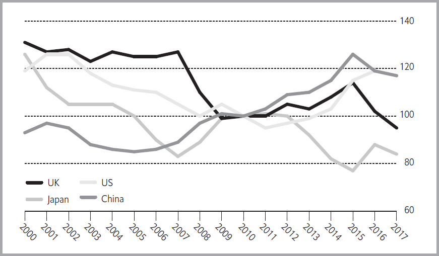

# 外汇市场

*回到[目录](./目录.md)*

## 每个国家的货币价格
在每个国家，价格都以货币单位表示，货币可能是该国中央银行发行的本币，也可能是个人更倾向于用于交易的其他货币。然而，货币本身的价值只能通过外部参考来判断。这种参考就是汇率，因此汇率成为任何经济体中的基本价格。大多数情况下，衡量货币价值的参考是其他货币。确定不同货币相对价值的任务则由外汇市场承担。

外汇市场是其他所有金融市场的基础。它直接影响各国的外贸模式，引导国际投资流动，并影响国内利率和通货膨胀率。外汇市场覆盖全球的每一个角落，涉及每一种货币。总体而言，它是规模最大的金融市场。2016年，每天的外汇交易量约为5.1万亿美元，涉及成千上万的外汇交易。

## 外汇交易的历史
外汇交易可以追溯到古代，其兴衰取决于国际贸易的规模和当时的货币制度。在中世纪，由金银铸造的硬币在欧洲各公国和王国间自由流通，外汇交易者提供硬币兑换服务，以安抚那些担心陌生硬币中贵金属含量可能低于宣称水平的人们。到14世纪末，意大利的银行家开始用各种货币发行的票据进行借贷，这些票据的折价取决于银行家对货币相对价值的判断。这种做法使国际贸易得以大幅扩展，超越了需要通过货物交换或用大量贵金属实物进行交易的限制。

然而，外汇交易在金融活动中仍是次要部分。18世纪，纸币被广泛使用，其价值主要由政府承诺支付的银或金的数量决定。由于这些数额变化不频繁，企业和投资者面临的汇率波动风险较小。除非涉及特定交易（例如出口销售或海外企业的购买），外币交易的需求很少。

即使在20世纪20年代和30年代主要经济体停止将货币与黄金挂钩后，它们仍试图保持汇率稳定。二战结束时建立的新货币制度被称为布雷顿森林体系（因协议签订地美国布雷顿森林而得名），这一体系也基于固定汇率。然而，这些安排在20世纪60年代末开始崩溃，1972年，各大经济体的政府决定让市场力量决定汇率。这种汇率水平的不确定性导致货币交易量显著增长。

## 外汇交易的增长与变化
20世纪90年代末，外汇交易量有所减少，主要有两个原因：

- **欧元的引入**：许多欧洲国家采用欧元作为货币，消除了这些货币间的所有外汇市场交易。
- **银行业整合**：全球银行业的整合大大减少了市场中具有显著影响力的公司数量。

2003至2004年，外汇交易量回升，因为机构投资者（尤其是对冲基金）在外汇市场上进行投机，以期获得比停滞的股市更高的收益。“高频交易”的发展也支持了外汇交易的持续增长，这种交易方式利用计算机按照数学算法下达买卖指令，并可能在购买后短时间内再次出售资产。然而，从2013年到2016年，以美元衡量的货币交易量有所下降，主要原因是美元升值降低了非美元货币交易的价值。

## 货币交易的方式

外汇市场由四个不同的市场组成，这些市场各自独立运作，但又紧密相连。

### 现货市场
现货市场用于即期交割的货币交易。一名游客购买外币就是一笔现货交易，一家企业决定立即将出口销售的收入兑换成本国货币也是一笔现货交易。在金融机构、货币经纪商和大型公司之间的大多数现货交易是通过电子方式安排的，尽管电话经纪服务仍然很重要。实际的货币兑换通常通过银行系统进行，并且一般在交易达成后的两天内完成，尽管某些交易（如美元兑加元交易）可以更快结算。随着在线交易降低了交易成本，个人投资者在现货市场的活跃度增加。然而，小额现货交易通常是面对面进行的，比如货币兑换商将个人的本国货币兑换成美元或欧元。

### 期货市场
期货市场允许参与者通过购买或出售期货合约在未来某个日期锁定汇率。例如，一家美国公司预计收到1000万瑞士法郎，可能会在芝加哥商品交易所购买瑞士法郎期货合约。这实际上可以保证公司收到的瑞士法郎按约定的汇率兑换成美元，从而保护公司免受瑞士法郎在收到款项之前贬值的风险。然而，最常交易的货币期货合约每季度到期一次。除非用户在合约到期的精确日期收到外币支付，否则它将面临汇率变化的风险，即收到外币和合约到期之间的时间差。

### 期权市场
在期权市场中进行的货币交易相对较少。货币期权最早于1982年在交易所交易，赋予持有者在特定时间内以指定价格购买或出售外币或外币期货合约的权利，但不是义务。（期权合约将在第8章中讨论。）

### 衍生品市场
如今，大部分外汇交易发生在衍生品市场。技术上讲，衍生品是指大量金融工具，包括期权和期货。然而，在常用的意义上，它指的是具有不同特征的、与交易所交易的期权和期货合约不同的工具。广泛使用的货币衍生品包括：

- **远期合约**：远期合约类似于期货合约，规定在约定日期以指定汇率出售一定数量的货币。然而，与期货合约不同的是，货币远期合约是通过经纪商和客户之间的直接安排来完成的。远期合约更加灵活，可以根据客户的需求精确安排金额和期限。
- **外汇掉期**：外汇掉期涉及在某一日期买卖货币，并在未来某一日期进行相同金额的对冲买卖，交易双方在交易开始时就确定了这两个日期。外汇掉期在2016年占所有外汇交易的约47%，比2013年增加了5个百分点，而现货市场交易的重要性则下降。
- **远期利率协议**：远期利率协议允许两方交换利息支付义务，如果义务涉及不同货币，则协议中会包含汇率成分。
- **障碍期权和限额期权**：这些衍生品允许用户限制其汇率风险。

尽管大规模衍生品交易是近年来的发展，但像外汇掉期这样的衍生品已经取代现货市场，成为外汇交易的最重要方式。

## 货币市场和相关市场

在大多数情况下，外汇交易与证券特别是债券和货币市场工具的交易密切相关。一个相信某种货币会升值的投资者通常不希望持有这种货币的现金形式，因为它不会带来任何回报。相反，投资者会购买所需的货币，将其投资于高流动性的有收益资产，然后在投资者希望出售货币本身的时机将这些资产出售以获得现金。

### 加杠杆
投资者通常希望通过增加杠杆率（也称为加杠杆）来增加对某种货币的敞口，而无需额外投入资金。这通常通过借入资金来购买更多的外币来实现。这是货币市场投资者增加杠杆率的最简单方式。杠杆现货交易通常是不值得的，因为必须支付的利息可能很容易超过投资者因汇率变动而获得的收益。期货和期权合约允许投资者以较少的现金投入，通过这些合约采取更大规模的押注来获得更大的收益。大型公司和机构投资者可能会在衍生品市场采取高度杠杆的头寸，如果两种货币之间的汇率按预期方向变化，则可以大幅获利；反之则可能造成巨大的损失。

### 参与者
外汇市场的参与者可以分为四类:

- **出口商和进口商**: 运营国际业务的公司必须以其在每个运营国家的本地货币支付供应商和员工，并可能从多种不同国家的客户处收款。最终，他们会将外币收入兑换为本国货币。历史上，支持国际贸易和旅行一直是货币交易的主要目的。然而，在现代，货币交易的交易量已经超过了商品和服务的贸易量。
- **投资者**: 许多企业拥有在其他国家的设施、持有物业或购买公司。所有这些活动都被称为外国直接投资，需要投资者获取外国国家的货币。更大的资金用于国际投资组合投资——购买以外币计价的债券、股票或其他证券。投资者必须进入外汇市场以获取购买货币、将其外部投资的收益转换为本国货币，以及当终止投资并将资本重新回流时再次兑换货币。
- **投机者**: 投机者只购买和出售货币，以从预期的汇率变化中获利，而不参与其他需要使用外币的业务交易。货币投机通常结合短期金融工具的投机，如国库券。最大规模的投机者包括主要银行和投资银行，其中几乎所有银行都会使用自有资金（而不是客户的资金）进行自营交易，还包括对冲基金和其他投资基金。货币的高频交易者也是投机者。
- **政府**: 国家财政或中央银行可能会进行货币交易，以影响汇率。政府通过购买一种货币并出售另一种货币来有意改变两种货币之间的汇率，称为干预。货币干预的数量从一个国家到另一个国家和时间的不同变化很大，主要取决于政府决定如何管理其外汇安排。此外，许多政府创建了国家所有的投资基金，称为主权财富基金，以进行贸易盈余或自然资源销售所获外汇的投资。这些基金的规模和国际关注度使得主权财富基金成为外汇市场的重要参与者。

### 主要交易地点  
货币市场没有固定的物理地点。大部分交易发生在银行间市场中，在许多不同国家都有金融机构参与。交易以前主要是通过经销商之间的电话对话进行的，但几乎所有交易现在都通过电子系统进行。这些系统的工作方式各不相同。有些系统允许寻求兑换10百万欧元的客户将请求输入计算机，并等待感兴趣的银行用他们建议的交易汇率作出回应。其他系统自动匹配买卖订单或将大投资者与单一银行链接在一起。随着电子系统变得更加复杂，买卖报价之间的差价显著缩小，这表明市场参与者的交易成本已大大降低。

尽管法律和技术上可以从任何地方进行货币交易，但大多数银行在现货市场的货币交易仍在同一个金融市场所在地进行。伦敦成为主导位置，其次是纽约。伦敦的全球交易份额在2013年到2016年之间有所下降，随着新加坡和香港的影响力上升，东京虽然曾挑战伦敦和纽约成为货币交易中心，但现在远远落后。少数几家巨型国际银行负责全球大部分货币交易。

2016年4月各种外汇工具的平均每日交易量比1998年报告的交易量多出三倍，尽管2013年到2016年之间的交易量有所下降。

**全球外汇市场4月日均成交额（以十亿美元计）**

| 项目 | 1998 | 2004 | 2010 | 2013 | 2016 |
| --- | --- | --- | --- | --- | --- |
| 现货交易 | 568 | 631 | 1489 | 2047 | 1652 |
| 远期交易 | 128 | 209 | 475 | 679 | 700 |
| 外汇掉期 | 734 | 954 | 1759 | 2240 | 2378 |
| 货币掉期 | 10 | 21 | 43 | 54 | 82 |
| 期权及其他 | 87 | 119 | 207 | 337 | 254 |
| 总计 | 1527 | 1934 | 3973 | 5257 | 5067 |

货币期货交易的模式截然不同。汇率期货最早是在芝加哥商品交易所发明的，多年来，它和巴西圣保罗的交易所是主要的货币期货交易所。近年来，随着印度和俄罗斯在国际贸易和投资中变得更加重要，印度国家证券交易所和莫斯科交易所也成为了重要的交易场所。然而，就交易合同的名义面值而言，芝加哥商品交易所仍然是领先者。在欧盟和日本的主要交易所中，没有交易汇率期货合同。一些较小的交易所，如波哥大和特拉维夫的交易所，确实交易货币期货合同，这些合同通常以本币与美元、欧元或日元之间的汇率为基础。然而，这些合同的交易量大多非常小。

2016年货币期货合同交易量最大的交易所

| 交易所 | 交易合同数量 | 交易合同名义价值（亿美元） |
| --- | --- | --- |
| 莫斯科交易所 | 930,716,193 | 963 |
| 印度国家证券交易所 | 396,431,206 | 405 |
| 印度孟买证券交易所 | 322,747,312 | 298 |
| CME集团，美国 | 196,951,833 | 18,857 |
| 巴西商品与期货交易所 | 163,892,083 | 4,747 |
| 韩国交易所 | 65,606,504 | 660 |
| 伊斯坦布尔交易所 | 41,670,839 | 37 |
| 约翰内斯堡证券交易所 | 34,393,431 | 35 |
| 墨西哥期货交易所（MexDer） | 8,632,764 | 85 |
| ICE期货交易所（美国） | 8,422,075 | 722 |

全球货币期货交易量在1995年达到9960万份合约的峰值。此后，由于投资者更倾向于交易不在交易所上市的衍生品，如远期合同和掉期合同，期货交易量大幅下降。然而，自2004年以来，货币期货重新获得了人气。2016年全球总交易量达22亿份合约，是2004年交易量的20多倍。

货币期权合同主要在美国、巴西和印度流行，最近在俄罗斯也开始受到关注。然而，在一些其他国家，货币期权被视为具有怀疑性。货币期权的主要交易所是芝加哥商品交易所、印度国家证券交易所和孟买证券交易所。货币期权也在其他几个交易所交易。在大多数情况下，合约是基于某种货币与美元之间的汇率，尽管也有些合约使用日元、欧元或英镑。经过一段时间的快速增长，2016年全球交易量达到6.5亿份合约。然而，全球交易量的四分之三以上（按合同数量计算）是在印度交易的。在其他大多数国家，交易所交易的货币期权似乎正在逐渐失去重要性，因为金融监管机构推动汇率衍生品在交易所进行交易，这类衍生品能比传统期权更精确地满足特定投资者的需求，而不再是银行与其客户之间的私人交易。

许多期权是在场外交易的，通常是在金融机构之间，而不是在交易所进行。在场外交易中，交易双方直接依赖对方付款，因为交易所并不充当中介。这意味着，如果一方在期权尚未结算时失败，另一方可能无法收回应得的款项。金融机构通常通过保持大量的期权合约来管理这种风险，这些合约可能会部分抵消彼此的影响；因此，如果银行A失败并无法按货币期权合约向银行B支付款项，银行B可能被免除按照类似合约向银行A支付款项的义务。这一过程被称为“净额结算”，同样适用于货币掉期和其他类型的衍生品合约。

场外货币期权交易在2007年经历了一次反弹，之前在1990年代末和2000年代初期有所滞后，但在2013年至2016年间再次下降。到2016年12月，未平仓的场外货币期权的市场价值为1.3万亿美元。英国无疑是这一业务最重要的地点，并且在近年来增加了市场份额，其后是美国和新加坡，且差距相当大。

## 最受欢迎的货币

最广泛交易的货币是美元，自1989年首次进行全面调查以来，美元一直占据所有交易的40%至45%。下表列出了2016年4月货币交易活动调查时按总交易份额排名的最广泛交易货币。最受欢迎的货币交易是美元与欧元的兑换，占货币市场活动的23%，美元/日元的交易占18%。涉及欧元和其他非美元货币的交易占外汇市场总交易量的8%。只有一小部分交易不涉及美元或欧元。

**全球外汇交易按货币分类** 日均成交量，%

|         | 2001 | 2007 | 2010 | 2013 | 2016 |
| ------- | ---- | ---- | ---- | ---- | ---- |
| 美元    | 45.0 | 42.8 | 42.5 | 43.5 | 43.8 |
| 欧元    | 19.0 | 18.5 | 19.5 | 17.6 | 15.7 |
| 日元    | 11.8 | 8.6  | 9.5  | 11.5 | 10.8 |
| 英镑    | 6.5  | 7.5  | 6.5  | 5.9  | 6.4  |
| 澳元    | 2.2  | 3.3  | 3.8  | 4.3  | 3.5  |
| 加元    | 2.2  | 2.2  | 2.7  | 2.3  | 2.6  |
| 瑞士法郎| 3.0  | 3.4  | 3.2  | 2.6  | 2.4  |
| 人民币  | -    | -    | -    | 1.1  | 2.0  |
| 瑞典克朗| 1.3  | 1.4  | 1.1  | 0.9  | 1.1  |
| 其他    | 9.0  | 12.3 | 11.2 | 10.3 | 11.7 |

伦敦在货币交易中心中是一个特殊的例子，因为其本国货币英镑在市场中的角色相对较小。伦敦市场上最常交易的货币对是美元和欧元，占所有交易的三分之一。2016年10月，伦敦交易中只有17%涉及英镑，而80%的交易一方以美元计价。伦敦市场上主要的交易如下表所示。

**伦敦市场的发展** 按货币对的交易额占比（%）

| 交易       | 2006 | 2012 | 2016 |
| ---------- | ---- | ---- | ---- |
| 美元/欧元  | 33   | 32   | 28   |
| 英镑/美元  | 15   | 13   | 13   |
| 美元/日元  | 13   | 11   | 14   |
| 美元/瑞士法郎 | 4    | 5    | 5    |
| 美元/澳元  | 3    | 7    | 5    |
| 美元/加元  | 3    | 4    | 4    |
| 英镑/欧元  | 3    | 3    | 3    |
| 欧元/日元  | 2    | 2    | 1    |

1999年1月单一欧洲货币欧元的推出显著改变了货币交易的位置和组成。自欧元推出以来，许多欧洲中心的交易量，包括巴黎、布鲁塞尔和罗马，已经大幅下降。欧元的创建最初还减少了美元的交易量，因为许多较小的欧洲货币之间的交易以前通常需要先兑换成美元，再兑换回其他货币；而现在，欧元区国家之间的交易不再需要这种复杂的安排。与此同时，一些不太显眼的货币，包括加拿大元、澳大利亚元和斯堪的纳维亚国家的货币，交易量有所增加。

新兴市场货币的交易占总每日交易的份额较小。几乎所有这些交易都涉及美元与东欧、亚洲和拉丁美洲货币之间的兑换。如果更多东欧国家寻求采用欧元，例如立陶宛在2015年达成的协议，较小货币的交易可能会进一步减少。然而，某些亚洲和非洲国家的快速经济增长可能会导致它们的货币交易量增加。2016年，涉及人民币的交易占场外交易的近4%，相比十年前几乎为零，显示出显著增长。

## 结算
一旦双方就货币交易达成协议，他们必须安排实际的货币交换，这一过程称为结算。在零售层面，结算非常简单且即时：一方将墨西哥纸币通过外汇兑换窗口交给对方，收到的是美元20美元钞票。期权和期货交易所的交易则由交易所自有的结算机构结算，因此市场参与者无需担心对方未能履行其义务。

然而，大宗现货和衍生品市场的交易则是另一回事。当双方达成交易后，他们会转向银行安排相关款项的转移。每家大型银行都是一个或多个清算机构的成员。这些机构有一些规则，旨在确保每家银行履行其义务。然而，这并不能得到完全保证。大型银行在任何时刻的待结算货币交易总额——即其总头寸——可能是其资本的数倍。而净头寸则是从其预计收到的款项中减去预计支付的款项，通常要小得多。但如果由于某些原因，这些交易没有及时结算，银行可能会突然陷入严重困境。

## 赫尔施塔特风险
最大风险来自于交易往往发生在多个时区之间。如果东京的一家银行与伦敦的一家银行达成了一笔大宗货币交易，那么伦敦银行的支付将在日本工作时间内到达东京银行，但日本银行的支付必须等到英国清算机构开盘后才能转账到伦敦银行。如果日本银行在收到来自英国的巨大支付后但还未做出相应支付前倒闭，那么英国银行可能会遭受致命损失，而其倒闭又可能危及与原始交易无关的其他银行。这种风险被称为赫尔施塔特风险，得名于1974年倒闭的一家德国银行——赫尔施塔特银行，该行在未完成交易的情况下倒闭，损失金额为6.2亿美元。通过加速结算过程来减少赫尔施塔特风险已成为全球银行监管机构的重要关注点，但彻底消除这一风险一直很困难。

## 汇率变动的原因
在非常短期内，汇率可能会非常波动，通常会对最新的新闻作出反应。投资者自然会倾向于选择强大、健康的经济体的货币，而回避经济疲弱、问题重重的经济体的货币。提案法案的失败、某个政治家的当选或是意外发布的经济数据都可能导致某种货币相对于其他国家货币的升值或贬值。

## 实际利率
然而，在较长时期内，汇率几乎完全由对实际利率的预期决定。一个国家的实际利率是投资者预期的利率，扣除通货膨胀后的利率。这并不是一个固定数字，因为不同的投资者对未来通货膨胀有不同的预期。例如，如果一个投资者能够锁定5%的利率，并预期价格将上涨2%，他们将预期获得3%的实际利率。

## 套期利息套利
通过实际利率影响汇率的机制被称为套期利息套利。为了理解套期利息套利，假设英国的一位投资者希望将100英镑进行一年期无风险投资，且没有任何交易成本。一个选择是，投资者购买一张一年期的英国政府债券。或者，投资者可以将100英镑兑换为外币，将外币投资于一年期政府债券，并在年底将收益兑换回英镑。那么，哪个选择能使投资者获利更多呢？这取决于现汇汇率、英镑和外币的利率、通货膨胀预期以及12个月后的远期汇率。

假设，为了简化计算，英国的利率为5%，美国的利率为7%，现汇汇率为1英镑=1.60美元，1年期远期汇率为1英镑=1.61美元。进一步假设，为了清晰起见，投资者预期两国没有通货膨胀。投资者面临以下选择：

| 投资于英国 | 投资于美国 |
| --- | --- |
| 初始资本 = 100英镑 | 初始资本 = 100英镑 × (1.60美元/1英镑) = 160美元 |
| 英镑利率 = 5% | 美元利率 = 7% |
| 一年后的资本 = 105英镑 | 一年后的资本 = 171.20美元 = 106.34英镑 |

通过这组合的汇率、预期通胀率和利率，投资者可以保证在购买美国债券时获得比购买英国债券更高的利润。购买美国债券的风险与购买英国债券的风险相同，因为投资者可以购买一个远期合约，允许其在一年后按照1英镑=1.61美元的汇率将171.20美元转换为英镑，从而消除任何关于汇率波动的担忧。

## 套期利息平价
然而，这种保证的利润是短暂的。许多投资者的计算机不断扫描市场，寻找价格异常，他们会发现这个不寻常的机会。当他们都试图在现货市场上将英镑兑换成美元，并在远期市场上将美元兑换回英镑，以便投资美国而非英国时，英镑将在现货市场下跌，而在远期市场上涨。最终，市场力量可能会将现货英镑/美元汇率压低至1英镑=1.59美元，并将一年期远期汇率推高至略高于1英镑=1.62美元。在这些汇率下，投资者将不再急于将英镑兑换成美元以投资美国，因为两种投资的年回报率将相同。此时，两种货币就达到了套期利息平价。

当然，在现实世界中，所有国家的市场利率和通胀预期每天都会变化，即使是最小的变化也会为拥有数百万美元投资的交易者创造短期的利息套利机会。他们争取获得最高回报的努力不可避免地推动汇率朝着套期利息平价的方向发展。

## 管理汇率
政府关于汇率管理的决策仍然是塑造货币市场的最重要因素。已经尝试了许多不同的汇率制度。所有这些制度都属于三种基本类别之一：固定、半固定或浮动。每种制度都有其优点，但也都有缺点，因为汇率管理与一个国家国内经济的管理密切相关。

## 固定汇率制度
固定汇率制度有多种类型。

### 金本位制
最古老的固定汇率制度类型是金属本位制。最著名的例子是金本位制，英国在1840年引入，其他大多数国家在1870年代也采纳了这一制度。在金本位制下，一个国家的货币供应量直接与其中央银行的黄金储备挂钩，货币可以随时兑换成黄金。如果多个国家采用金本位制，它们之间的汇率将保持稳定。例如，在19世纪末和20世纪初，英国的金本位制将100英镑等于大约220盎司的黄金，而美国的金本位制将100美元等于4.5盎司黄金，因此1英镑可以兑换4.86美元。

这一制度被认为是自我修正的。如果一个国家由于例如进口超过出口而出现经常账户赤字，外国人会获得更多该国货币，而它们不希望持有这些货币。中央银行无法通过贬值来消除经常账户赤字，因为金本位制排除了贬值的可能性，这会减少货币购买的黄金数量，从而使出口变得更便宜，进口变得更贵。相反，当外国人用货币兑换黄金时，中央银行的黄金储备会减少，迫使其减少流通中的货币量。货币供应量的缩减会将经济推入衰退，通过减少对进口的需求来使经常账户平衡。这被证明是一种痛苦的纠正经常账户失衡的方法，金本位制时期多个国家经历了长期的萧条或恐慌。自第一次世界大战结束以来，真正的金本位制就没有再被使用过。

### 布雷顿森林体系
另一种固定汇率制度是布雷顿森林体系，它基于外汇和黄金。布雷顿森林体系试图通过允许存在持续国际收支赤字的国家在特定条件下贬值来解决金本位制的问题。一个新的组织——国际货币基金组织（IMF）成立，向成员国提供黄金或外汇贷款，以帮助它们应对短期的国际收支危机，并避免贬值。1969年，IMF甚至创造了自己的货币——特别提款权（SDR），各国可以用它来结算相互之间的债务。SDR被分配给中央银行，用于增加它们的储备。截至2013年，SDR的价值被任意设定为66美分、0.423欧元、12.1日元和11.1英镑便士的总和，因此它对任何单一货币的价值都会波动。由于各种原因，布雷顿森林体系在1960年代末和1970年代初崩溃，这与金本位制崩溃的原因相似。

### 固定汇率挂钩
固定汇率的另一种形式是挂钩汇率。这意味着一个国家决定将其货币的价值与另一种货币保持固定，通常是与其重要贸易伙伴的货币挂钩。例如，丹麦将其货币与欧元挂钩，因为它与19个欧元区国家的贸易占据主导地位。挂钩汇率始终是有可能变化的，而且这种变化的可能性本身就可能使货币产生不稳定。

货币委员会是一种特殊的挂钩汇率制度，旨在避免不稳定。货币委员会取代了中央银行，只有当每单位货币都有等额外汇储备支持时，才发行货币。这确保了任何想以官方汇率将本国货币兑换成外币的人都可以做到这一点。如果投资者出售本国货币，货币委员会的储备会减少，并自动按相同的金额减少国内货币供应量，从而迫使利率上升并迅速减缓经济。货币委员会能够稳定货币的程度仅限于政府能够抵制那些在利率上升时受到损害的人的反对。货币委员会与简单挂钩汇率的主要区别，除了强制储备外，还在于改变汇率需要通过法律。香港有一个货币委员会，它将其货币与美元挂钩。爱沙尼亚曾有一个货币委员会，将其货币克朗与欧元挂钩，直到2011年爱沙尼亚废除了克朗，并采用了欧元。

## 固定汇率的缺点
尽管固定汇率制度各有不同，但它们都存在相同的缺点。只要资金可以自由进出一个国家，利率就必须足够高，以吸引投资者持有本国货币以获取有吸引力的回报。因此，该国的中央银行被迫将其货币政策的全部精力用于维持汇率稳定。这意味着中央银行无法追求其他目标，比如抑制通货膨胀或降低利率以振兴疲软的经济。

2002年1月，阿根廷通过货币委员会将比索固定挂钩美元的汇率制度崩溃了。问题的根源在于这种制度的僵化性。阿根廷政府为了维持固定汇率，放弃了对货币政策的控制，无法通过降低利率来应对经济萧条。高企的失业率和下降的经济产出引发了政治反弹，导致政府辞职以及比索与美元1:1汇率的放弃。许多阿根廷企业因以美元计价的债务而被迫违约，因为以贬值后的比索收入不足以偿还这些债务。

固定汇率还为投资者提供了一种无风险的套利机会，他们可以借入利率较低的外币，然后投资于本国。这可能导致金融危机。例如，假设A国的一年期利率为10%，而A国的货币与B国货币挂钩，B国的一年期利率为5%。A国的投资者可以以5%的利率从B国借款，将外币兑换为本币，并以10%的回报在本国投资。一年后，投资者可以用同样的汇率获得外币偿还贷款。虽然这对单个借款人来说是合理的，但如果许多企业都采取这种策略，A国中央银行可能没有足够的外汇储备来满足对B国货币的需求，从而被迫放弃固定汇率。这将使借款人购买外币偿还贷款的成本更高，并导致部分借款人违约。这种情况导致了1997年印尼、韩国、泰国和其他东亚国家的金融危机。

## 半固定汇率制度
固定汇率制度的实际问题促使一些国家引入混合系统，以在提供汇率稳定的同时，允许政府在追求其他经济目标方面有更大的灵活性。这些系统都允许一定程度的货币波动，因此它们比固定汇率制度带来更多的外汇市场交易。大多数此类系统涉及**管理浮动**，即政府允许货币的价值随着市场力量的变化而波动，但积极寻求引导市场。以下是几种变体：

### 汇率区间（Bands）
欧洲汇率机制（ERM）是欧盟许多国家在1999年采用单一货币之前遵循的一种系统。该机制要求各国货币对德国马克的汇率保持在一定范围内。只要货币的汇率在区间内，它就被允许浮动。然而，如果货币对马克的汇率大幅升值或贬值并达到区间的上下限，该国中央银行就必须调整利率以维持汇率在区间内。不幸的是，这种管理浮动系统并没有像设计者期望的那样稳定。在1992年和1993年，马克对英镑、意大利里拉、瑞典克朗和其他一些货币大幅升值，迫使这些国家大幅提高利率以保持汇率稳定。英国最终退出了该系统，并允许英镑自由浮动。一些其他国家则在经历大幅贬值并设定新的汇率区间后才得以继续留在该系统内。

### 目标区间（Target zones）
与汇率区间类似，但政府的承诺是非强制性的。政府可能希望其货币对另一种货币的汇率保持在某一范围内，但未必承诺采取行动来维持该汇率区间。如同汇率区间，一个政府可以单方面设定其货币对另一种货币的目标区间，也可以由多个国家共同商定。

### 货币篮子挂钩（Pegs and baskets）
管理浮动的另一种形式是将货币挂钩于一篮子外币，而不是单一货币。如果货币挂钩于单一货币，而该货币相对第三种货币升值，那么从第三国的进口将变得更便宜，而向该国的出口则更难出售。这可能导致国际收支危机。将挂钩设为对多种货币的平均汇率，而不是单一货币，能在一定程度上缓解这一问题。政府可以通过调整货币篮子中各外币的权重来管理汇率。新加坡和科威特是管理货币挂钩于外币篮子的国家之一。在两种情况下，货币篮子的具体组成是保密的，并可能不时调整。中国在2005年宣布，其货币将不再单一挂钩美元，而是改为挂钩一篮子货币，并公开了篮子中的货币种类，但未披露权重。

### 爬行钉住汇率（The crawling peg）
这是一种通常以预先宣布的方式调整汇率的机制。例如，中央银行可能宣布将在未来一年内每月允许其货币对美元的汇率贬值1%。这比固定汇率更灵活，但仍然需要中央银行致力于维持货币以预期速度贬值，而无法用于其他目的。如果投资者认为汇率贬值速度过慢，他们可能会大量将本币兑换为外币，从而导致中央银行外汇储备耗尽，并迫使货币贬值。1994–1995年的危机后，墨西哥放弃了对美元的爬行钉住汇率，改为让比索自由浮动。

## 浮动汇率制度
在浮动汇率制度下，汇率不再是货币政策的目标。政府和中央银行使用政策实现其他目标，比如稳定国内物价或刺激经济增长，并允许汇率随着市场力量自由波动。世界主要货币现在彼此之间自由浮动，这产生了对货币交易的大量需求。一些重要国家（如墨西哥、巴西和韩国）在危机使管理汇率无法维持后采纳了浮动汇率。然而，说汇率完全自由浮动并不准确。一些国家偶尔会采取行动（通常不公开其意图）来推动特定汇率朝某个方向变化。这通常只发生在某种货币的价值与经济基本面严重脱节时。

尽管如此，大多数国家以某种方式管理汇率。然而，世界经济活动的主要部分发生在采用浮动汇率的国家。

## 比较货币估值
市场和政策制定者如何判断一种货币是否被高估或低估？这个问题并不简单。有些人会回答“永远无法判断”，认为当前的市场价格是唯一能反映货币价值的有效指标。然而，实际上有大量的实证证据表明，外汇市场常常会出现“超调”现象。这意味着，当政治或经济新闻导致某种货币剧烈波动时，它的波动幅度通常超过了谨慎分析所预测的范围，因为许多投资者同时采取相同的行动。一旦市场意识到该货币已超调，它通常会部分回调，并在一个中间水平上稳定下来。

## 超调的迹象
有三种迹象表明一种货币可能被严重错误估值。首先，货币与其他货币的汇率可能没有朝着涵盖利差平价（covered interest parity）方向移动，这表明市场预期未来会有大幅升值或贬值。其次，一个国家可能会出现长期且持续的国际收支赤字或盈余。尽管许多国家可能在多年内都有国际收支赤字或盈余，但大量的赤字或盈余可能表明该货币相对于主要贸易伙伴的货币过于强势或弱势。

第三个误估迹象是，当一个国家的贸易商品税前价格与另一个国家差异很大时。这一方法基于购买力平价理论（Purchasing Power Parity），该理论认为，给定数量的货币应该能够在不同国家购买相同数量的贸易商品。《经济学人》的巨无霸指数就是一个简单的购买力平价指南，它通过比较不同国家汉堡包的价格（以美元表示），来估算货币相对于美元是否被高估或低估。更多详细的分析通常由世界银行和私人公司发布，研究不同国家的各种商品价格。

## 管理浮动汇率
当政府和中央银行认为汇率已经偏离它们认为合适的水平时，它们可能会努力推动市场。这并不困难。如果政府或中央银行能够降低投资者对通货膨胀的预期，其货币将会升值。如果中央银行能够在保持通胀控制的同时降低短期利率，那么该国的货币将相对于那些未降低实际利率的国家货币贬值。

然而，在许多情况下，政府或中央银行希望在不根本改变经济政策的情况下调整汇率。例如，政府可能认为其利率政策对于降低失业率是适当的，即使它对汇率感到不满。在这种情况下，试图调整汇率更多的是一种心理上的行动，而非经济上的行动。这种努力注定会失败，因为经济政策一次只能实现一个目标。如果货币政策用于降低失业率，它就不能同时用于实现期望的汇率。

在这种情况下，政府和当局通常会通过干预来支持下跌的货币或压低上涨的货币。干预通常是秘密进行的，通常涉及使用外汇储备在市场上购买本国货币，从而提高本国货币的汇率。在某些情况下，中央银行会通过在远期市场而非即期市场购买本国货币进行干预。这两种方式都可能使那些激进押注货币将下跌的投资者和交易者遭受重大损失。由于这一风险，外汇市场对政府官员稍微透露的干预意图高度敏感。

然而，中央银行可用于干预的资金相对于每日交易的货币量而言是很少的。它也是有限的，受到国家储备的限制。因此，除非国家的经济政策发生变化，否则干预或暗示干预的官方评论通常不会长期影响汇率。否则，交易员会很快察觉到中央银行失去干预的意愿或外汇储备不足，汇率将恢复原来的走势。

## 获取价格信息
除非政府支持固定汇率，否则没有一个固定的汇率价格用于货币交易。银行、电子信息系统（如路透社）和电子货币交易系统会在客户的屏幕上显示报价。通常，交易商提供买入价，即他们为每单位外币支付的本币数量，以及一个更高的卖出价，客户可以用这个价格购买货币。买卖价格之间的差价是交易商的利润，并涵盖了交易操作的成本。然而，交易商屏幕上提供的价格只是参考价；最近的交易可能发生在这些价格，也可能没有发生，客户可能无法获得报价价格。大多数交易商会为大宗交易提供比小额交易更有利的汇率。

许多日报和网站提供货币价格表。下表列出了前一个交易日交易商提供的汇率，因此它们不一定代表发布当天可获得的汇率。通常，这些汇率是针对大宗商业交易的，比普通游客能获得的汇率要优惠得多。表2.5展示了一个典型的货币价格表的摘录。

该表格发布在美国，因此所有价格以美元表示；在其他国家，表格通常以当地货币报价。列出的国家是与美元交易最为活跃的国家。价格以两种不同方式报告：第二列和第三列给出了购买一个单位相关货币所需的美元数量（按最近两天的汇率），第四列和第五列则列出了用1美元可以购买多少单位的另一种货币。

### 远期汇率
除了即期汇率外，下表还列出了交易最活跃货币（英镑和加元）的远期汇率。这些远期汇率表示投资者为一月、三月或六个月后交割的货币所需支付的价格。对于加元，远期汇率高于即期汇率，这表明投资者预期未来几个月内加拿大的实际利率将相较于美国利率上升，导致汇率也随之走强。英镑预计在未来六个月内相对美元略有走弱。

| 国家        | 星期二美元等值   | 星期一美元等值     | 星期二美元买入    | 星期一美元买入   |
|-------------|----------------|----------------|----------------|----------------|
| 阿根廷      | 0.2590         | 0.2590         | 3.8601         | 3.8601         |
| 澳大利亚    | 0.8119         | 0.7996         | 1.2316         | 1.2506         |
| 巴林（第纳尔） | 2.6525         | 2.6532         | 0.3770         | 0.3769         |
| 巴西        | 0.5227         | 0.5227         | 1.9077         | 1.9077         |
| 加拿大      | 0.8955         | 0.8950         | 1.1167         | 1.1173         |
| 1个月远期   | 0.8960         | 0.8955         | 1.1161         | 1.1167         |
| 3个月远期   | 0.8969         | 0.8960         | 1.1149         | 1.1161         |
| 6个月远期   | 0.8985         | 0.8975         | 1.1130         | 1.1142         |
| 智利        | 0.001876       | 0.001879       | 533.09         | 532.32         |
| 英国        | 1.6281         | 1.6288         | 0.6142         | 0.6139         |
| 1个月远期   | 1.6281         | 1.6287         | 0.6142         | 0.6140         |
| 3个月远期   | 1.6279         | 1.6280         | 0.6143         | 0.6143         |
| 6个月远期   | 1.6276         | 1.6279         | 0.6144         | 0.6143         |

### 交叉汇率
需要一种不同类型的表格来报告货币的交叉汇率。以下表格将相同的货币列在表格的顶部和左侧。表格中的每个单元格显示各国货币之间的汇率，而不需要通过第三种货币（如美元）进行换算。例如，10丹麦克朗在这一天可以兑换2.148瑞士法郎，而1瑞士法郎可以兑换4.655丹麦克朗。

然而，实际上交叉交易仅限于交易量最大的货币。例如，一家日本公司可以轻松地将日元直接兑换为欧元。但如果一家马来西亚公司想要购买波兰兹罗提，则需要先将林吉特兑换为一种主要货币（如欧元或美元），然后再用这种主要货币兑换兹罗提。

**货币交叉汇率**

| 货币         | 加元（C$） | 丹麦克朗（DKr） | 欧元（€） |  
|--------------|------------|----------------|------------|  
| 加拿大（C$） | -          | 4.673          | 0.628      |  
| 丹麦（DKr）  | 2.140      | -              | 1.345      |  
| 欧元（€）    | 1.592      | 7.438          | -          |  

### 货币指数
评估两种货币之间的汇率变化相对简单。然而，要评估某种货币随时间的表现则复杂得多，因为必须考虑该货币相对于许多其他货币的表现。

#### 贸易加权汇率
最广泛使用的方法是构建一个贸易加权汇率，这是一个包含货币对所有贸易伙伴的汇率表现的指数。加权是基于该国与每个贸易伙伴之间的贸易份额。例如，墨西哥的贸易加权汇率在很大程度上取决于比索和美元之间的汇率，因为美国占墨西哥对外贸易的约三分之二；捷克共和国的贸易加权汇率大约有一半由捷克克朗与欧元之间的汇率决定。该指数通常在某个基准年份设定为100，然后衡量该货币随后的表现。

下图显示了由国际结算银行根据与其他经济体的贸易所准备的四种货币的加权汇率。计算贸易权重的其他方法会得出不同的货币表现变化。

这些指数存在所有指数共有的问题，例如未能考虑自起始日期以来贸易模式的变化。尽管如此，它们清晰地表明了货币市场中的两个基本事实。首先，没有哪种货币能永远强势，因此“买入并持有”并不是外汇市场中一种盈利的策略。其次，货币在相对较短的时间内可能会大幅波动，对于那些足够敏锐、能够猜测市场走向的投资者，可能会带来巨大的收益。

