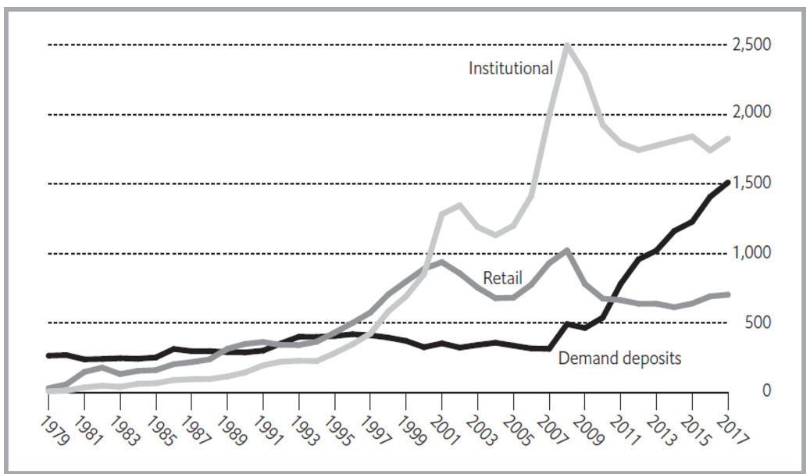
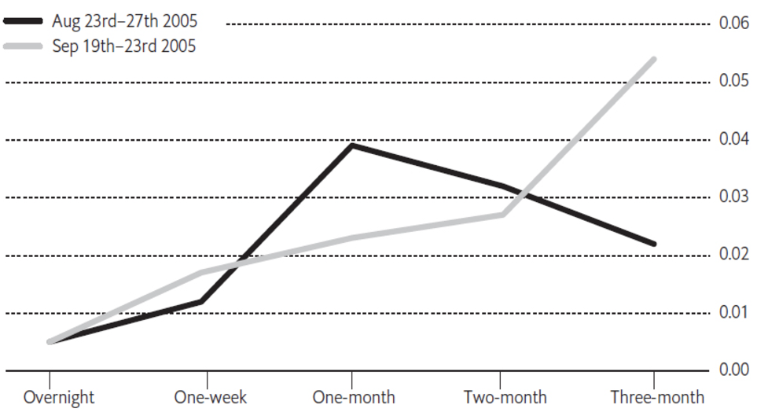

# 货币市场

*回到[目录](./目录.md)*

**货币市场**一词指的是一个由公司、金融机构、投资者和政府组成的网络，他们处理短期资本流动。当企业需要在几个月内筹集现金，直到一笔大额款项到账；或者银行希望投资存款人随时可以提取的资金；又或者政府在面临税收季节性波动时需要支付工资，所有这些短期流动性交易都发生在货币市场。

近年来，货币市场由于银行业普遍的资金外流而显著扩展，这一过程被称为“去中介化”。直到20世纪80年代初，几乎所有国家的金融市场都集中在商业银行。储户和投资者将大部分资产存入银行，通常以短期活期存款形式存入，如支票账户，这些存款通常不支付利息或支付很少的利息，或者以定期存单的形式存放，资金可能需要多年才能取出。银行借助这种稳定的低成本资金供应，成为企业和消费者的主要信贷来源。

金融放松管制和电子化资金转移的便利性使得银行在存款和贷款方面的市场份额逐渐流失。这一趋势得到了立法的支持，比如1980年美国的《货币控制法》，该法允许市场力量而非监管机构来决定利率。投资者可以将资金存入提供有竞争力利率的投资公司，而不需要长期承诺。许多借款人可以将短期债务出售给类似的实体，同样以竞争性利率，而不需要与银行谈判贷款。货币市场正是使得这些借款人和投资者能够在不经过银行这种相对昂贵的中介的情况下进行交易的机制。它使借款人能够解决短期流动性需求，并在面对不规则的现金流时避免使用更昂贵的融资方式。

每种货币都有可识别的货币市场，因为不同货币之间的利率不同。这些市场并不是独立的，投资者和借款人会根据相对利率从一种货币转移到另一种货币。然而，法规限制了某些货币市场投资者持有外币工具的能力，大多数货币市场投资者关注的是最小化由于汇率波动带来的损失风险。因此，大多数货币市场交易发生在投资者的本国货币中。

货币市场并不存在于某个特定的地点，也没有统一的规则。它们也不提供一套统一的价格表，也没有统一的利率。相反，它们是一个个由电话和计算机联系起来的借贷网络。每个网络的中心是中央银行，其政策决定了该货币的短期利率。在中央银行周围，是成千上万企业和政府机构的财务主管，他们的任务是将不需要的现金投资得尽可能安全和盈利，并在必要时以最低成本借款。它们之间的联系是通过银行和以交易证券为主营业务的投资公司建立的。这些多方参与者在某一时刻的最佳可得利率的不断询价，推动市场保持竞争力。

2007年开始的全球金融危机在货币市场上产生了强烈的影响。货币市场投资者通常非常规避风险；即，他们更看重资金的绝对安全，而不是承担风险所能获得的更高回报。由于许多银行和工业公司出现了财务困境，投资者开始担心其账目的准确性，甚至不愿意在极短期内提供信贷。货币市场的“冻结”阻碍了美国和大部分欧洲地区的正常借贷活动，导致这些经济体进入衰退。最近，2008年到2017年间，许多国家的极低短期利率使得投资者不再愿意持有货币市场工具。

## 货币市场的作用

货币市场没有精确定义，但通常用来指购买和出售到期时间为一年或更短的债务工具。因此，货币市场与债券市场相关，债券市场是公司和政府基于长期合同进行借贷的市场。与债券投资者类似，货币市场的投资者也是在提供信贷，但他们并不拥有借款实体的所有权，也不参与其管理。

然而，货币市场和债券市场（将在第4章中讨论）有不同的作用。债券发行人通常筹集资金，用于资助能在未来多年内产生利润——或者对于政府发行人来说，产生公共利益的投资。而货币市场工具的发行人通常更关注现金管理或融资其金融资产的投资组合。

一个运作良好的货币市场有助于促进长期证券市场的发展。货币市场为流动性——即立即可用的资金——定价。极短期资金的利率作为长期金融工具的基准利率。如果货币市场活跃或“流动”，借款人和投资者总有机会进行一系列短期交易，而不是长期交易，这通常会抑制长期利率的上升。如果没有活跃的货币市场来确定短期利率，发行人和投资者可能对长期利率的合理性缺乏信心，也可能担心在需要时无法出售他们的证券。因此，货币市场不活跃的国家通常也会有不太活跃的债券市场。

### 投资货币市场

短期工具通常对小型投资者并不具有吸引力，因为了解借款人的财务状况的高成本可能会超过购买期限为三个月的证券所获得的收益。因此，投资者通常通过基金而非直接购买个别证券来购买货币市场工具。

### 货币市场基金

货币市场的扩展得益于一种特殊的实体——货币市场基金，这些基金将货币市场证券集中起来，允许投资者通过基金持有的各种公司和政府证券来分散风险。零售货币市场基金面向个人投资者，机构货币市场基金则服务于公司、基金会、政府机构及其他大型投资者。法律或监管通常要求这些基金只投资于现金等价物，这些证券的安全性和流动性使它们几乎与现金一样可靠。

|  |
| :--: |
| 美国货币市场基金资产和需求存款（年末，单位：十亿美元）|

货币市场基金是一种相对较新的创新。它们降低了投资者的搜索成本和风险。货币市场基金还能够以比银行更低的成本履行中介角色，因为货币市场基金不需要维护分支机构、接受小额账户，或者处理银行客户的多样化需求。此外，与银行不同，货币市场基金通常不需要将一部分投资者的资金预留出来以应对投资损失，这使得它们能够为投资者支付比银行更高的利率。货币市场基金支付给投资者的利率与它们借出这些资金的利率之间的差距通常只有几个百分之零点几，而不是银行支付给存款人和向借款人收取的几个百分点之间的差距。

短期资本流入投资基金而非银行的趋势在美国最为先进，因为美国比大多数其他国家更早开始金融行业的放松管制。货币市场基金资产的流入与短期和长期利率之间的差距有关；在2001年至2005年间，由于极低的短期利率鼓励投资者将资金投入其他地方，美国货币市场基金的资产有所下降。同样的现象使得在2008年之后，随着利率下降到许多货币市场基金的年利率低于1%，许多国家的投资者减少了对货币市场资产的持有。图3.1展示了这种变化。

根据投资公司协会的数据，截至2017年底，全球货币市场基金的资产接近6万亿美元，重新达到2008年的峰值。美国货币市场基金的投资者拥有其中的54%的资产。在包括德国、日本和英国在内的多个股票和债券市场活跃的国家，货币市场基金相对不发达。

### 稳定价值
在许多情况下，货币市场基金通过宣传尽管利率可能波动，但基金的份额具有固定价值，吸引了投资者。在美国，货币市场基金通常保持每份1美元的固定价值。这种固定价值使得货币市场基金相对于银行存款更具吸引力，因为银行存款的价值不会每日波动。

推广稳定价值的难点在于，基金所持有的货币市场证券的价值可能会波动。特别是，由公司发行的短期证券，如果发行者遇到财务困境或宣布破产，可能会失去大部分甚至全部价值。在这种情况下，货币市场基金可能只有在运营基金的投资公司投入足够资金以弥补证券价值的下降时，才能维持其稳定价值；否则，基金的每份价值将需要下降，导致投资者的损失。管理公司没有法律义务支持其货币市场基金，但它们可能选择这样做，以保护其运营的其他基金的声誉。

2009年，货币市场基金的脆弱性成为问题，当时某些银行的倒闭摧毁了部分货币市场基金所持有证券的价值。在这些案例中，基金通过将每份价值降低至正常水平以下来确认损失——在美国，这一事件被称为“跌破面值”。中央银行担心投资者恐慌性撤资，可能会造成更大的损失，因为基金会抛售证券，进而危及那些定期出售货币市场证券以满足现金需求的企业。美国联邦储备银行及其他一些中央银行介入，提供有限期限的货币市场基金价值担保，实际上为货币市场投资者提供了与银行存款人类似的保护。

在那场危机之后，多个国家的监管机构试图要求货币市场基金的每份价值波动，即每日的价值取决于基金所持有证券的价值。货币市场基金的管理者强烈反对这一变动，因为他们认为，宣布投资者可能会失去部分本金会使这些基金变得不那么具有吸引力。截至2016年，固定价值的货币市场基金仍可出售给美国的个人投资者，但销售给公司和其他机构投资者的基金则要求根据所持证券的市场价值声明浮动值。

### 个人扫尾账户 (Sweep Account)
运营股权基金和债券基金的投资公司通常提供货币市场基金，用于存放投资者希望保持可随时投资的现金。拥有大量资产的人通常通过扫尾账户投资货币市场工具。这些是银行或证券公司提供的多功能账户，资产可用于支付当前账单、投资股票或购买共同基金。任何未被使用的现金将在每天结束时自动“扫尾”进入货币市场基金或隔夜投资，以赚取最高的可能回报。

### 机构投资者
货币市场基金并不是唯一投资货币市场工具的投资者。所有大型银行都设有交易部门，积极进行短期证券的投机。主要持有债券或股票的投资信托（共同基金）通常会将其资产的一小部分投资于货币市场工具，以提供灵活性，部分是为了应对投资者要求赎回信托份额而无需处置长期持有的证券。养老金基金和保险公司，通常会进行长期投资，也会将其资产的一部分投资于货币市场工具，以便随时获得现金，而无需清算长期仓位。2017年底，美国企业拥有6300亿美元的货币市场工具，包括商业票据和货币市场基金的份额。某些类型的货币市场工具，尤其是银行存单，通常由个人投资者直接持有。

### 利率和价格
货币市场的借款人需要为所借款项支付利息。大多数货币市场证券支付固定利率，利率由发行时的市场状况决定。一些发行者倾向于提供可调利率工具，这些利率将根据发行时制定的程序定期变动。由于货币市场工具通常是短期的，因此它们在生命周期内通常不支付定期利息，而是以折价的方式出售给投资者。投资者可以在到期时按面值赎回它们，赎回时的利润代替了利息支付。

货币市场证券的价值与短期利率变化呈反向关系。由于货币市场工具本质上是短期的，其价格波动性远低于长期工具的价格，因此在持有证券直到到期与按照当前收益率投资之间的损失或收益较小。

## 工具类型
货币市场工具有许多种类。最著名的包括商业票据、银行承兑汇票、国库券、政府机构票据、地方政府票据、银行间贷款、定期存款和国际组织发行的票据。在一年内发行的金额远大于任何时刻的未偿金额，因为许多货币市场证券的存在期很短。

### 商业票据
商业票据是私营部门公司或政府支持的公司发行的短期债务工具。在大多数情况下，商业票据的期限（即到期日）超过90天，但少于九个月。这一期限由相关法规规定。在美国，大多数新证券必须在发行前向证券监管机构——证券交易委员会（SEC）注册，但到期日为270天或更短的证券则免于这一要求。商业票据通常是无担保的，尽管某些商业票据可能由发行者的特定资产提供担保，或由银行担保。

商业票据市场最早在19世纪末期在美国发展起来。其主要优势在于，它允许财务状况良好的公司以比直接向银行借款更低的利率满足短期融资需求。在美国银行存款尚未受到保险保障的时期，短期公司债务对储户而言并不一定比银行存款更具风险。大萧条后，政府创建了存款保险计划，商业票据的受欢迎程度下降。到1980年代初，美国的商业票据年发行量仅为银行贷款年发行量的五分之一。

1980年代，商业票据变得极为流行。在高通胀和飙升的短期利率时期，监管规定限制了银行对储户支付的利息。货币市场基金使投资者能够赚取比银行提供的更高利率，强大的非银行公司发现，通过向货币市场基金销售商业票据，它们能够比向银行借款以更低的成本筹集资金。这些因素促使了商业票据市场的繁荣。该市场继续快速增长，尽管由于金融市场状况，偶尔会出现中断。2007–08年金融危机期间，商业票据的发行量急剧下降。

由于金融自由化在美国比其他国家更早实施，美国的商业票据市场是最早发展的。然而，其他国家的商业票据市场也迅速发展，美国在全球发行中的份额已有所下降。

在金融危机前的几年里，金融机构的商业票据发行量急剧增长，如表3.1所示。这一类公司包括融资工业设备、航空器租赁公司以及汽车制造商的融资子公司等。这些公司与银行竞争，通常发现使用商业票据为个人借款人提供贷款比成为银行、收集存款并承担相应监管费用更具利润。然而，由于2008年许多银行和非银行金融公司遇到困难，投资者不愿购买它们的商业票据。因此，一些公司未能成功融资，无法偿还到期的商业票据，从而导致破产。金融危机后，美国的商业票据市场出现下滑。到2016年，市场规模达到了自2000年以来的最低点，但在2017年迅速反弹。

在大多数其他国家，商业票据的发展较慢，因为缺乏法律框架。例外的是加拿大，在2006年，商业票据的未偿余额达到了1640亿加元，但在金融危机后市场出现大幅收缩，并且政府介入以保证支付。到2010年，市场规模缩减至540亿加元，只有最高点的三分之一左右，到2017年初，仅增长至约600亿加元。

**美国公司商业票据未偿余额** 经季节调整，年末，单位：十亿美元

| 金融机构 | 非金融机构 | 总计 |
| --- | --- | --- |
| 1992 | 407 | 146 | 553 |
| 2000 | 1206 | 398 | 1604 |
| 2004 | 1268 | 120 | 1388 |
| 2008 | 731 | 202 | 933 |
| 2012 | 508 | 208 | 716 |
| 2016 | 459 | 278 | 737 |

除了国内发行外，2017年国际市场上未偿还的商业票据总额超过5500亿美元。这个金额指的是在发行者所在国家以外出售，并且未以发行国货币计价的票据。约40%的国际商业票据以美元计价，30%以欧元计价，其余大部分以英镑计价。欧元计价的国际商业票据的份额在2011年前逐渐增加，因为它可以在欧元区内交易，且没有货币风险，但在金融危机重新爆发后，欧元计价的发行量有所减少。国际商业票据发行的最大来源是德国，这反映了德国银行的重要性以及在德国国内市场发行此类证券的困难，其次是美国、英国、荷兰和西班牙。

许多大型公司都有持续的商业票据计划，每几周或几个月就会发行新的短期债务。发行人通常会将商业票据进行滚动，利用新发行的票据所得款项偿还之前票据的本金。实际上，这使得发行人能够以短期利率借款，尽管这些短期利率可能远低于长期利率。这种短期债务的性质降低了投资者感知的风险。

这些持续的借款计划并非没有风险。如果市场状况或公司的财务状况变化导致无法发行新的商业票据，而借款人又没有足够现金偿还到期票据，则会面临违约风险。2001年和2002年，美国和欧洲的几家公司就发生了这种情况，2008年到2012年间，一些国家的银行也遭遇了类似问题：信用评级机构下调了其评级，导致它们无法发行新商业票据，从而面临严重的现金短缺。有些公司通过银行的临时贷款避免了破产，但其他公司则被迫宣布破产。希望发行商业票据的公司通常会从银行获得“备用”信用额度，在无法滚动债务时可以用来偿还未偿的票据。银行对于提供此类信用额度的犹豫或无法提供信用额度，是自2008年以来商业票据发行量下降的原因之一。使用商业票据还存在一种风险，即如果利率上升，连续短期借款的总成本可能会高于公司在利率较低时进行长期借款的成本。

### 银行承兑汇票
在1980年代之前，银行承兑汇票是企业在货币市场上筹集短期资金的主要方式。承兑汇票是一种由非金融公司向银行发行的承诺票据，以换取贷款。银行将票据以折扣价转售到货币市场，并提供付款保证。承兑汇票的到期日通常不到六个月。

银行承兑汇票与商业票据有显著区别。承兑汇票通常与特定商品的销售或储存有关，例如出口订单，其款项将在两到三个月内收到。金融行业的公司不发行此类票据。承兑汇票不支付利息；相反，投资者以低于面值的折扣价购买承兑汇票，并在到期时以面值赎回。投资者依赖于担保银行的信用，而不是发行公司的信用来保证其安全。

在银行能够比其他类型公司以更低成本借款的时代，银行承兑汇票使制造商能够利用银行的优越信用地位。这一优势在很大程度上已经消失，因为许多其他大型企业借款者的信用被认为至少和银行一样好。尽管银行承兑汇票仍然是一些公司融资的重要来源，但由于商业票据的灵活性和较低的成本，其重要性已大大减少。1974年，美国银行承兑汇票的未偿还金额最高达740亿美元，但此后稳步下降；自2000年以来，未偿还金额接近零。在其他一些国家，尤其是加拿大，银行承兑汇票的发行量更大，2017年加拿大未偿还金额为770亿加元。

### 国库券
国库券（通常称为t-bills）是由国家政府发行的、到期时间为一年或更短的证券。由政府以本国货币发行的国库券通常被认为是该货币中最安全的投资。这类证券在货币市场交易中占有的份额超过任何其他类型的证券。

不同政府和不同时间点，货币市场和长期债务的发行比例差异很大。像其他借款者一样，当短期和长期利率差距较小的时候，政府通常会选择进行长期借款；而在长期债务成本相对较高时，则更倾向于选择短期借款。例如，美国政府从1996年开始就致力于减少其借款的平均期限，以降低利息成本，但在2005年宣布将恢复发行30年期债券以融资增加的国家债务。到2013年，约有1.6万亿美元的美国国库券未偿还，占近12万亿美元公共债务的不到八分之一。同样，加拿大政府在2000年时短期借款占总借款的约五分之一，到2013年增加至超过四分之一。日本政府曾强烈偏好长期债券，但在2001年后大幅增加了短期证券的发行。法国在2004年强调短期政府债务，但在2005年将大部分短期债务替换为长期债务。英国则传统上避免发行短期国债，但在2012/13财年，其短期国债的存量从2001年的20亿英镑增加到超过700亿英镑。然而，随着2016年长期利率达到极低水平，许多政府发现，通过将短期证券替换为长期债券，可以锁定低借款成本。

如果政府无法说服投资者购买其长期债务，国库券可能成为其主要融资来源。这是1980年代新兴市场国家国库券发行大幅增长的主要原因。许多这些国家有着通货膨胀或政治不稳定的历史，这使得投资者对长期债券心存戒备，迫使政府和非政府借款人使用短期工具。随着国家在经济和财政管理上的声誉得到改善，它们通常能够借到更长期的资金，而不再完全依赖短期工具。例如，到1999年底，巴西政府的53%债务将在一年内到期，但随着政府能够以更有利的利率获得长期融资，短期借款逐渐减少。

一些新兴市场国家发行了以外币计价的国库券，主要是美元，以便以低于本国货币利率的成本借款。这一策略需要频繁地再融资短期外币债务。当货币突然贬值导致再融资债务的本国货币成本上升时，除非外国投资者愿意购买新的国库券来偿还到期债务，否则政府可能无法履行义务。这导致了1995年墨西哥、1998年俄罗斯和1999年巴西的债务危机。

国库券市场的总体规模每年都会发生显著变化，具体取决于各国政府财政政策的状况。由于从预算赤字转向预算盈余，导致美国、加拿大、大多数欧盟国家和一些新兴市场的政府债务减少，因此该市场在1990年代末期有所萎缩。但在2000年以后，随着许多政府增加预算赤字以应对经济衰退，市场规模再次扩大。自2008年起，随着美国和许多欧洲国家经历了大规模政府赤字，该市场迅速增长。

### 政府机构债券
许多国家的国家政府机构和政府资助的公司在货币市场上是大量借款者。这些包括如发展银行、住房金融公司、教育贷款机构和农业金融机构等实体。

美国政府机构成为最重要的货币市场借款者之一，特别是在1990年代和2000年代初期，它们大幅增加了短期债务的发行量。这些机构包括田纳西河谷管理局（Tennessee Valley Authority，电力公用事业）和联邦住房贷款银行系统（Federal Home Loan Bank System，储蓄机构的中央管理机构）。

### 地方政府票据
地方政府票据是由州、省或地方政府及其机构（如学校管理局和交通委员会）发行的。这些政府在发行货币市场证券的能力上因国家而异。在某些情况下，需要获得国家当局的批准；而在其他情况下，地方机构只能向银行借款，不能进入货币市场。

短期地方政府证券的一个常见用途是应对税收收入的季节性波动。此类证券称为税收预期票据，通常在税收收入预期较低时发行，用于为一般政府运作提供资金，并在税收支付期限后赎回。地方政府及其机构还可能发行短期票据，以预期来自上级政府的资金转移。这使它们即使尚未收到来自上级当局的资金，也能继续推进支出计划。

### 银行间贷款
银行间贷款是指一个银行向另一家没有关联的银行提供的贷款。许多这样的贷款跨越国际边界，并且借款机构将这些资金再贷给自己的客户。截至2017年3月，银行向其他国家的银行的未偿贷款总额超过14万亿美元，其中5万亿美元为银行间贷款。几乎所有这些贷款都计划在一年内到期。银行间贷款流动是一个重要机制，表明一个国家的信贷条件放松或收紧时，会影响到其他国家。

银行对本国其他机构的贷款远远大于对外部机构的贷款。隔夜贷款是从一个银行向另一个银行提供的短期无担保贷款。这些贷款可用于帮助借款银行为客户提供贷款，但通常借款银行会将这笔资金添加到其储备中，以满足监管要求并平衡资产负债表。

银行间短期贷款的利率已变得具有国际重要性。许多金融工具的利率与伦敦银行间拆借利率（Libor）挂钩，Libor是英国重要银行对彼此提供隔夜贷款时的平均利率。2012年，英国当局指控多家银行“操纵”Libor，提交了关于对其他银行贷款的利率虚假信息，导致Libor人为抬高，使借款人需支付过高的利率。

另一种新的利率，欧元区银行间拆借利率（Euribor），是欧洲银行相互借款的利率，对于以欧元计价的金融工具，Euribor履行着与Libor相同的功能。在美国，联邦基金利率是银行之间借贷过剩准备金时的利率，是美联储的主要政策工具，因此被广泛关注。每种利率仅适用于贷款给健康、信誉良好的机构。如果银行认为另一家银行可能面临倒闭的风险，它会提高利率，甚至可能拒绝提供贷款，以避免如果借款人破产，贷款无法偿还。

### 定期存款
定期存款，或称存单（CD），是具有利息的银行存款，必须在指定日期之前提取，否则将面临罚款。虽然定期存款的期限可以长达五年，但期限不到一年的定期存款通常与其他货币市场工具竞争。30天期限的定期存款是常见的。大额定期存款通常由公司、政府和货币市场基金用于短期投资。到2018年初，美国银行持有16万亿美元的大额定期存款，其中近一半由外国银行在美国的分支机构持有。

### 国际机构债券
国际机构债券是由世界银行、泛美开发银行和其他由成员国政府拥有的组织发行的。这些组织通常根据利率和汇率的变化，使用多种货币进行借款。

### 回购协议  
回购协议（Repos）在货币市场中发挥着关键作用。它们有助于保持市场高度流动，从而确保市场上始终有足够的买家来购买新的货币市场工具。

回购协议是两项交易的组合。在第一项交易中，证券经销商（如银行）将其拥有的证券出售给投资者，并同意在未来以指定的更高价格回购这些证券。在第二项交易中，几天或几个月后，回购协议被解除，经销商从投资者那里买回证券。投资者借出的金额低于证券的市场价值，这个差额被称为“头寸折扣”（haircut），以确保如果证券的价值在经销商回购之前下跌，投资者仍然拥有足够的抵押物。

对于投资者而言，回购协议为其提供了一种盈利的短期现金使用方式。对于大投资者来说，如果其投资金额超过银行保险所覆盖的金额，可能会认为回购协议比银行存款更安全，因为如果银行倒闭，回购协议没有亏损的风险。投资者通过两种方式获利。首先，投资者以比购买价格更高的价格转售证券，实质上是在收取贷款给经销商的利息，利率称为回购利率。其次，如果投资者认为证券价格会下跌，可以出售证券，并在回购协议解除前不久购买等值的证券返回给经销商。与此同时，经销商以最便宜的方式获得了贷款，并可使用所得资金购买更多证券。

在逆回购协议中，角色互换，投资者将证券卖给经销商，然后再回购。对投资者来说，逆回购协议的好处是可以以低于其他工具的利率使用现金。

回购协议和逆回购协议使得经销商（如银行和投资银行）能够保持大量的货币市场证券库存，同时通过将其证券借出保持流动性。因此，它们已成为经销商融资的重要来源。许多经销商和投资者还通过匹配交易在回购市场上建立仓位，以从预期的利率变化中获利。这可能涉及在一种证券中安排回购协议，在另一种证券中安排逆回购协议，且两者都在同一天到期，预期两种证券价格的差异会发生变化。

投资者喜欢回购协议，部分原因是其灵活性。回购协议的平均期限只有几天，但可以根据需求安排任何期限。投资者可以安排隔夜回购协议，这种回购协议的利率最低，但必须在第二天偿还；也可以安排定期回购协议，通常是3到6个月的期限，利率略高；或者安排开放式回购协议，直到一方要求终止，利率接近隔夜回购利率。历史上，大多数回购协议涉及国家政府票据，或在美国涉及联邦资助的机构票据，尽管其他类型的证券也变得更为常见。但是，在2007-08年金融危机中，由于对这些证券的真实价值存在不确定性，投资者变得不愿接受非政府证券作为回购协议的抵押物。美国回购活动的减少减少了银行的贷款能力，进一步加剧了金融危机并转变为经济衰退。

回购市场最初是由于政府对银行短期存款利率的限制而产生的。它在美国这一最大市场中迅速增长。即使在金融危机后有所下降，2016年底回购贷款的未偿金额仍达4400亿美元。欧洲回购市场发展较慢，直到最近才变得较大。然而，一项调查发现，2016年12月欧洲银行的回购总额平均为5.7万亿欧元，是2001年时的三倍。约60%的欧洲回购市场是以欧元计价，其余主要以英镑和美元计价。

在日本，自1976年以来，使用日本政府债券进行的回购（gensaki）就已经开始交易。由于商业票据的增加和交易税的影响，gensaki市场在1980年代有所萎缩。到1998年，gensaki的未偿金额仅约为900亿美元。作为1998年金融市场改革计划的一部分，日本银行（中央银行）宣布将恢复日本回购市场，但截至2016年，该市场仍然较为有限，约为1250亿美元。

### 期货与货币市场
货币市场的投资者使用与货币市场利率相关的期货合约，目的包括对冲和现金管理。通过买入或卖出短期利率或短期债务证券的期货合约，投资者可以在合约到期日，如果相关利率高于或低于预定水平时获利。利率期货也可以用来对冲或覆盖货币市场工具因利率变化而可能贬值的风险。许多国家的期货市场交易以三个月期国债为基础的合约，也有以隔夜银行贷款利率为基础的合约。机构投资者将期货合约与短期票据和商业票据一起，作为其货币市场策略的重要组成部分。（期货市场将在第8章中讨论。）

## 交易如何进行
货币市场工具的交易几乎完全通过计算机系统进行。银行和非银行的货币市场工具交易商与彼此或与中央结算所签订合同，承诺按约定的条款完成交易。

一些结算所是政府机构，例如英格兰银行的中央货币市场办公室，而其他结算所，如纽约的存托信托公司和布鲁塞尔的Euroclear，则是由银行和市场中活跃的交易商共同拥有的合作性机构。当交易发生时，一方或双方负责将交易事件电子报告给结算所，结算所通过借记购买方交易商的银行账户并贷记卖方交易商的账户来结算交易。大多数货币市场工具仅以电子账面登记形式存在，并始终由结算所持有；交易完成后，结算所仅代表新所有者而非原所有者持有该工具。结算所通过这种方式减少了对手风险——即交易双方可能未履行义务的风险。结算所通常不充当调查或执行机构，因此，如果买卖双方对交易条款存在争议，必须由双方自行解决或通过法律程序解决。

由于涉及大量资金，一家重要银行或证券经纪商的倒闭，若存在大量未结算的交易，可能会对其他银行和经纪商构成威胁。因此，结算所一直在努力实现实时结算，即在交易报告后尽快转移资金和证券。

### 信用评级与货币市场
评级机构是提供借款人信用worthiness意见的私人公司。国债票据、机构债券、地方政府债券和国际机构票据的发行人通常在将其发行带到市场之前会获得评级。一些商业票据的发行也会被评级，尽管在许多情况下，评级机构更倾向于评估发行人的多年度商业票据计划，而不是对每个单独的发行进行评估。参与银行间贷款和购买银行承兑汇票的投资者通常关注的是相关金融机构的评级，而不是特定交易的评级。

全球有三家公司对货币市场发行人进行评级：穆迪投资者服务、标准普尔(S&P)和惠誉。这些评级机构的短期企业债务评级在下表中有所列出。其中一些评级机构还设有独立的评级尺度，用于评估短期政府债务、商业票据和银行的实力。许多其他评级机构则专注于某些特定行业或国家的评级。

**短期信用评级**

| | 穆迪 | 标准普尔 (S&P) | 惠誉评级 (Fitch) |
| --- | --- | --- | --- |
| 非常强的偿付能力 | Prime-1 | SP-1+ | F1, F1+ |
| 强的偿付能力 | Prime-2 | SP-1 | F2 |
| 足够的偿付能力 | Prime-3 | SP-2 | F3 |
| 投机性的偿付能力 | 非Prime | SP-3 | B, C |
| 违约 | | | D |

### 等级重要性

这些评级对市场有很大影响。在美国，货币市场基金主要投资于一级商业票据，一级商业票据是指至少获得两个评级机构最高短期评级的票据。基金不得将超过5%的资产投资于二级票据，二级票据是指不符合一级票据标准的票据。因此，无法获得一级评级的公司发行的商业票据相对较少，市场上几乎没有低于投资级别的票据。同样，财务实力评级较低的银行将难以吸引存款单，并且任何评级机构降低银行评级时，存款人将要求更高的利率或完全撤资。

## 货币市场与货币政策

货币市场在许多国家中央银行执行货币政策中发挥着核心作用。直到最近，国家中央银行的工作主要是通过公开市场操作，间接地调节经济中信用的数量，以管理经济增长和通货膨胀。这些操作涉及购买和出售政府债务给政府证券交易商，从而向银行系统注入或抽取资金，这会影响银行的贷款行为，从而影响经济中的支出和需求。

然而，现如今，在金融体系发达的国家，中央银行通常通过回购市场来管理货币政策，而不是通过直接购买和销售证券。在这种制度下，中央银行与交易商签订回购协议，支付给交易商的资金流入交易商的银行，向银行系统注入准备金。当回购到期时，交易商将资金返还给中央银行，除非中央银行继续进行新的回购交易，否则资金将被抽离银行系统，准备金水平将下降。

如果中央银行希望从系统中抽取准备金，它会进行匹配销售–购买交易，将证券从其投资组合中出售给交易商，并与交易商达成未来的回购协议。

### 货币市场与货币政策

货币市场在许多国家中央银行执行货币政策中发挥着核心作用。直到最近，国家中央银行的工作主要是通过公开市场操作，间接调节经济中的信用量，以管理经济增长和通货膨胀。这些操作涉及向政府证券交易商购买和出售政府债务，从而向银行系统注入或抽取资金，这会影响银行的贷款行为，并进而影响经济中的支出和需求。

然而，现如今，在金融体系发达的国家，中央银行通常通过回购市场来管理货币政策，而不是通过直接购买和销售证券。在这种制度下，中央银行与交易商签订回购协议，支付给交易商的资金流入交易商的银行，从而向银行系统注入准备金。当回购到期时，交易商将资金返还给中央银行，除非中央银行继续进行新的回购交易，否则资金将被从银行系统中抽走，准备金水平将下降。

如果中央银行希望从系统中抽取准备金，它会进行匹配销售–购买交易，将证券从其投资组合中出售给交易商，并与交易商达成未来的回购协议。

### 中央银行利率

在许多国家，中央银行还可以通过向金融机构提供贷款，以发布的利率直接向货币市场提供信贷。这些贷款主要用于帮助经历资金突发提取或面临流动性不足的金融机构。中央银行贷款利率通常比私人部门提供的贷款利率低，以此鼓励金融机构首先在货币市场借贷，然后才向中央银行借款。中央银行利率变化的频率通常低于货币市场利率的变化。美国和日本的主要中央银行贷款利率称为贴现率；英国相应的利率为基准利率，加拿大为加拿大银行利率；欧洲央行（ECB）向欧元区银行提供贷款的利率为边际贷款利率。

公开市场操作对货币市场的利率产生直接影响。中央银行使用货币市场利率加速或减缓经济增长，会影响投资者对通货膨胀的预期，这又会影响长期利率。因此，公开市场操作使中央银行能够在一定程度上对中长期利率产生影响。

### 关注短期利率

中央银行、政府和投资者密切关注短期利率。

### 利差

特别是，利差，即不同工具之间的利率差异，是市场参与者预期的高度敏感指标。

其中一个重要的利差是无担保贷款与回购协议之间的利差。由于回购协议是完全有担保的，因此几乎没有还款中断的风险。然而，银行之间的无担保贷款如果某银行倒闭，则存在风险。因此，这两类贷款之间的利差反映了市场对信用的认知。比较不同国家的利差是很有启发的。例如，在1998年冬季，英国家庭无担保的三个月贷款与三个月回购协议之间的平均利差为21个基点（百分之一点），美国为5.6个基点，法国为8个基点，而日本为58个基点，较大的利差反映了普遍认为许多日本银行财务状况极为虚弱的看法。

美国联邦储备银行和加拿大银行密切关注不同类别的商业票据之间的利差。AA评级和较弱的A2-P2评级之间的利差通常为15到20个基点。利差的扩大可能表明投资者担心经济恶化，这会使A2-P2票据的发行人比AA评级票据的发行人更容易面临财务困境。金融公司发行的顶级商业票据与非金融公司发行的票据之间的利差也反映了市场的紧张情绪，因为在经济好转时，金融公司和非金融公司发行的票据利率通常差不多。欧洲央行依赖回购协议来执行货币政策，这使得两周期欧元回购利率成为一个重要的指标。德国政府证券的两周期回购与短期票据之间的利差也在市场中受到相当的关注。

### 隔夜利率

隔夜银行存款利率也受到密切关注。在一些国家，这被称为“隔夜拆借利率”；在欧元区国家，则称为Eonia（欧元隔夜指数平均利率）。不同到期日的货币市场工具的利率差异是最敏感的经济指标之一。例如，在2005年，由于多年的经济增长疲软以及银行业问题加剧，日本经济开始出现复苏迹象。全年利率极低。2005年8月末，备受关注的隔夜银行存款利率年利率接近零，而三个月存款的年利率平均为0.02%。一个月后，如图3.2所示，隔夜利率仍然很低，但三个月存款的利率开始上升，因为借款人对资金的需求增加。

用更技术化的语言来说，收益率曲线是追踪来自同一发行人的不同到期日证券的利率收益率，至少在长期端，收益率曲线在一个月内变陡。为什么？持有三个月期的投资者可以选择进行91次连续的隔夜投资，而不是一次性进行三个月的投资。因此，三个月期利率可以被视为对未来三个月隔夜利率的预测。它通常高于隔夜利率，以补偿通货膨胀可能侵蚀投资者本金的风险。三个月利率在12月的下降表明，年底时投资者认为日本银行很可能不会像12月初预期的那样迅速提高利率，因为经济状况未能如预期那样改善。（收益率曲线将在第4章中详细讨论。）

|  |
| :--: |
| 日本货币市场利率 |

### 基准利率

基准利率在几十年前被设立为美国银行对其最佳企业借款人收取的利率，曾一度在新闻媒体中引起广泛关注。虽然大企业借款人不再受到基准利率的影响，但它仍然是某些浮动利率消费者信贷的基础，包括信用卡贷款和房屋净值贷款。因此，基准利率的上升通常会抑制消费者支出。然而，该利率变化不频繁，且每次变化幅度为0.25%，而非根据货币市场条件每日调整。美国的另一种货币市场利率——调整至平均一年期的美国国债利率，用作许多可调利率抵押贷款的基础。随着越来越多的美国人选择可调利率抵押贷款，它的经济影响逐渐增加，尽管与其他一些国家不同，美国这种类型的个人抵押贷款利率每年只调整一次。

### 英国抵押贷款利率

相比之下，英国的可变利率抵押贷款利率在几周内就会传递到房主手中，因此对经济几乎有即时影响。这些利率通常以0.25%的增幅变动，且贷方可以根据需要随时调整利率以及相应的抵押贷款付款额。这使得抵押贷款利率成为英国最敏感的经济指标之一。